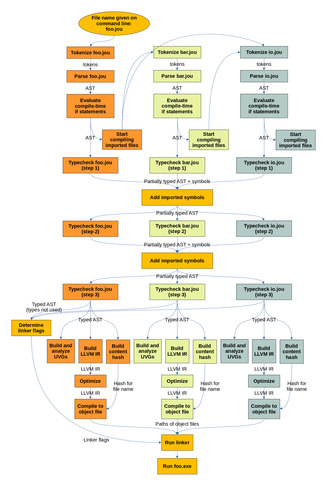

# How does the compiler work?

Suppose you have file `foo.jou` with the following content:

```python
import "./bar.jou"
import "stdlib/io.jou"

def main() -> int:
    printf("Foo\n")
    bar()
    return 0
```

And file `bar.jou` with this content:

```python
import "stdlib/io.jou"

@public
def bar() -> None:
    printf("Bar\n")
```

Let's also assume that the `jou_compiled` folder is empty or doesn't exist yet.
Feel free to delete it if you want to try this. (The compiler will create it again as needed.)

The following picture shows what happens when you run `jou foo.jou`:



Here's what each step does:
- **Tokenizing** basically means splitting the source code into small parts called tokens.
    For example, `printf("hi\n")` is split into the tokens `printf`, `(`, `"hi\n"` and `)`.
    Each token also has a kind: `(` is an operator token and `printf` is a name token.
    Tokens are defined in [compiler/token.jou](../../compiler/token.jou)
    and created in [compiler/tokenizer.jou](../../compiler/tokenizer.jou).
    See also [syntax-spec.md](syntax-spec.md).
- **Parsing** means creating an Abstract Syntax Tree (AST) from the tokens.
    AST sounds like a fancy concept, but it's actually really simple:
    it is just nested data structures that represent the code.
    For example, there is an `AstIfStatement` instance for each `if` statement that appears in the code.
    AST data structures are defined in [compiler/ast.jou](../../compiler/ast.jou)
    and instantiated in [compiler/parser.jou](../../compiler/parser.jou).
- **Evaluating compile-time if statements** must be done before looking at what other files are imported.
    For example, if there is a Windows-specific `import` statement under `if WINDOWS:`,
    we want to ignore it when not compiling for Windows.
- **Type checking** means figuring out what type everything in the code is,
    whether the code tries to access something that doesn't exist,
    and a few other things.
    For details, see [type-checking.md](./type-checking.md).
- **UVGs** are used only to show error messages and warnings.
    They are used to detect undefined variables and a few other common mistakes.
    See [uvg.md](uvg.md) for details.
- **Hashes** are included in file names to detect when whether files need to be recompiled.
    See [lazy-recompile.md](./lazy-recompile.md) for details.
- Jou uses [the LLVM library](https://en.wikipedia.org/wiki/LLVM) to compile the code.
    (This is the only external library used in the Jou compiler.)
    **LLVM IR** is LLVM's representation of the code.
    Each Jou file corresponds with an **LLVM IR module**
    that contains all functions and other content of the corresponding Jou file.
- **Optimizing** is done by LLVM. See [perf.md](../perf.md).
- **Compiling LLVM IR to object files** means generating `.o` files into the `jou_compiled` folder.
    This is also done by LLVM.
    There is one `.o` file for each Jou file being compiled.
- The **linker** is a program that combines object files together into an executable file.
    Running the linker is also called **linking**.

To make the compiler easier to debug, command line flags can be used
to stop the compilation and print what we have at various points:

```
$ ./jou --tokenize-only examples/hello.jou   # Show tokens
$ ./jou --parse-only examples/hello.jou      # Show untyped AST
$ ./jou --uvg-only examples/hello.jou        # Show UVG
```

You can also tell the compiler to print more information
with the `-v`/`--verbose` flag:

```
$ ./jou -v examples/hello.jou   # High-level overview
$ ./jou -vv examples/hello.jou  # Show all details
```


## Gotchas and unusual things

Unlike many other compilers, the Jou compiler does not have "Jou IR" between AST and LLVM IR.
The Jou compiler used to have a "Jou IR" (called CFGs) that was generated from AST,
and then LLVM IR was generated from the "Jou IR".
I deleted the "Jou IR" because it was a lot of code, and it felt like LLVM IR but worse.

Instead of "Jou IR", there are [builders](../../compiler/builders/) to abstract away details of the AST.
For example, suppose that you want to replace LLVM with something else.
To do this, you don't need to know anything about the AST,
you just add a new builder that replaces [the LLVM builder](../../compiler/builders/llvm_builder.jou).

**The AST is mutated during type checking.**
The types of expressions, function arguments and other such things are attached directly to the AST.
There are also a few other cases where the AST is changed afterwards.
For example, `foo.bar` in Jou code can be a class member lookup (`foo` is an instance of [a class](../classes.md))
or an enum lookup (`foo` is [an enum](../enums.md)).
The parser doesn't know, because it is not aware of imports or other things defined later in the same file.
Instead, this is determined during type checking.
